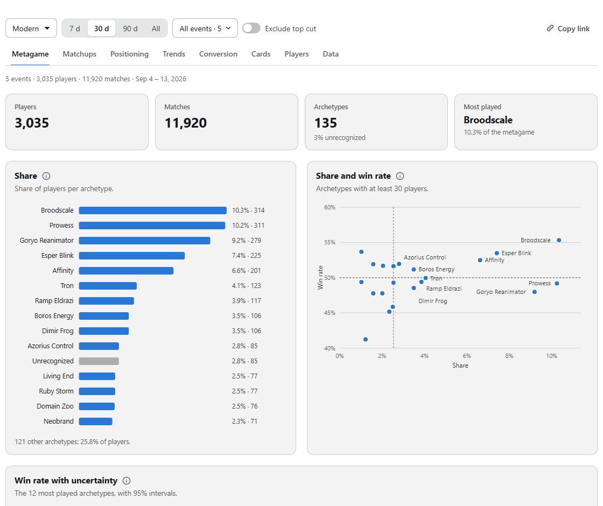
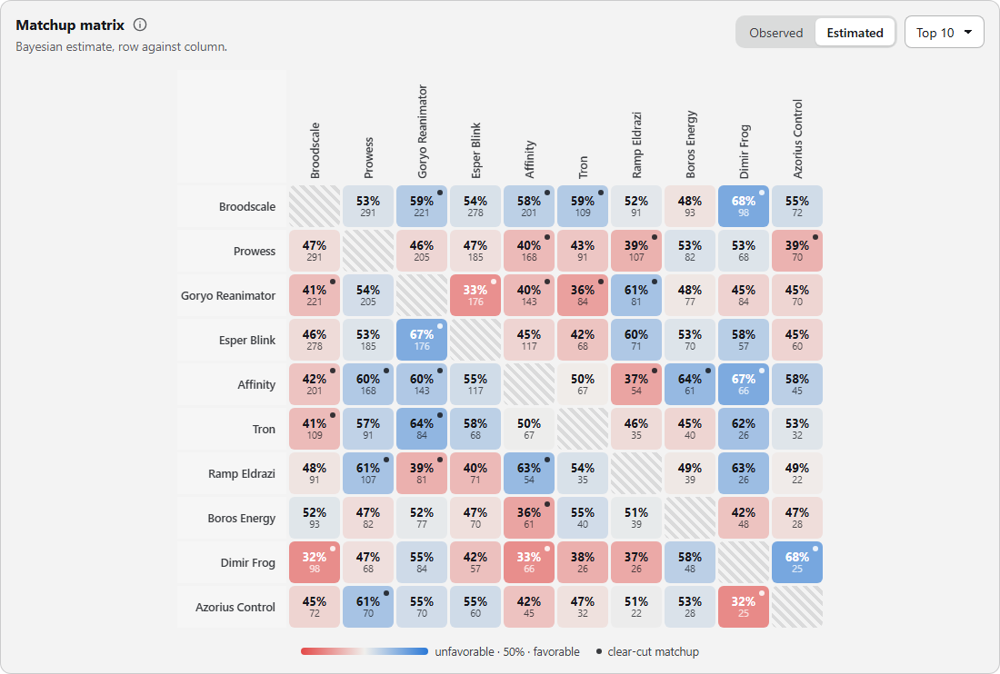
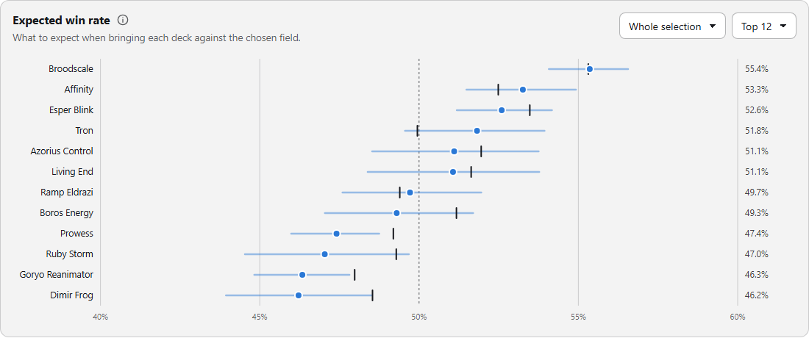

# MTG Stats

**Metagame analytics for Magic: The Gathering tournaments, as a WordPress plugin.**

MTG Stats imports tournament results from [melee.gg](https://melee.gg), either directly or through the public
[MTGODecklistCache](https://github.com/Jiliac/MTGODecklistCache). It detects each deck's archetype from its
decklist and publishes an interactive dashboard on any page with the `[mtgstats]` shortcode.

Nothing is copied by hand and no archetypes are tagged in a spreadsheet: a 1,500-player event goes from a Melee
link to a published matchup matrix in a few minutes.



> The dashboard and the admin panel are available in **English** and **Italian** and follow the site language.

## Features

**Data import**
- Browse MTGODecklistCache by month, filter by name or format, and import events in bulk. Each event comes with
  standings, round-by-round pairings and full decklists.
- Import any public Melee tournament from its URL. Rounds in a different format, such as the draft rounds at a
  Pro Tour, are excluded automatically.
- CSV export of standings, matches and decklists.

**Archetype detection**
- A faithful JavaScript port of [MTGOArchetypeParser](https://github.com/Badaro/MTGOArchetypeParser), using the
  community rules of [MTGOFormatData](https://github.com/Badaro/MTGOFormatData). Rules cover Modern, Pioneer,
  Standard, Legacy, Vintage and Pauper.
- Colors are worked out from lands and spells. For cards too new to be in the rules, colors come from
  [Scryfall](https://scryfall.com).
- Aliases, custom rules and per-player manual overrides. Overrides survive re-classification.
- In tests on a 928-deck Modern event, 98% of decks were classified, in 25 ms.

**Dashboard**

| Tab | What it shows |
|---|---|
| Metagame | Share, share vs win rate, Bayesian-smoothed win rate with 95% credible intervals, full archetype table |
| Matchups | Matchup matrix, observed or Bayesian-estimated, with clear-cut matchups flagged; draw rates |
| Positioning | Expected win rate against a chosen field (all, Day 2, Top 8, latest event); equilibrium metagame; strongest matchups |
| Trends | Share and win rate per event, week or month; metagame diversity; risers and fallers |
| Conversion | Day 2 (auto-detected), Top 8/16/32 or winning-record conversion; how the metagame shifts from all players to Day 2 to Top 8 |
| Cards | Average decklist (copyable), sub-variants found automatically, per-card win-rate impact, copies distribution |
| Players | Cross-event leaderboard and a player + deck rating model ("deck or pilot?") |
| Data | Per-event CSV downloads and every player's result |

| Matchup matrix | Positioning |
|---|---|
|  |  |

**Interface**
- **Fits the host site.** The dashboard inherits the theme's font and text color. It detects whether the page is
  light or dark, and takes its accent color from the WordPress theme, the plugin settings or the shortcode.
- **Archetype profile.** Click an archetype anywhere (chart, table, matrix) to open a side panel with:
  - key numbers and conversion;
  - presence over time;
  - every matchup;
  - variants, average list and best results.
- **Shareable views.** The tab, format, period, events and open archetype are kept in the URL, so "Copy link"
  shares exactly what you see.
- **Short copy, details on demand.** Each chart has a one-line description and an ⓘ button with the full explanation.
- **English and Italian.** The language follows the WordPress site (Italian for `it_*` locales, English otherwise);
  the shortcode can force it with `lang`. Numbers and dates are formatted for that language.
- **Accessible.** Charts and tabs work with the keyboard, tooltips work on touch, focus moves to dialogs and returns
  when they close, and motion is reduced when the visitor asks for it.
- **No dependencies.** Charts are hand-written SVG, with no frameworks and no external requests from the visitor's
  browser.


## Installation

1. Download `mtgstats-1.0.0.zip` from the [latest release](https://github.com/mattialopresti/mtg-meta/releases/latest).
2. In WordPress, go to **Plugins → Add New → Upload Plugin**, choose the zip, then click **Install** and **Activate**.
3. Open **MTG Stats** in the admin menu. On the **Import** tab, pick a month, click **Search tournaments** and import a
   few events.
4. Add the shortcode to any page:

   ```
   [mtgstats]
   ```

Requirements:
- WordPress 5.8+ and PHP 7.4+.
- A current browser: the dashboard uses modern CSS such as `color-mix()`.
- For imports, the administrator's browser must reach `api.github.com`, `raw.githubusercontent.com` and
  `api.scryfall.com`. The server must reach `melee.gg`, for direct Melee imports only.

### Shortcode options

| Attribute | Default | Description |
|---|---|---|
| `format` | most common format | Initial format, e.g. `Modern`, `Pauper` |
| `days` | `30` | Initial period: `7`, `30`, `90`, any number of days, or `all` |
| `tournaments` | *(empty)* | Comma-separated tournament IDs; locks the selection to those events |
| `tabs` | all | Subset of `meta, mu, pos, trend, conv, cards, players, data` |
| `theme` | `auto` | `auto` follows the page background; `light` or `dark` force a theme |
| `accent` | theme / settings | Accent color as a hex value, e.g. `#c2412d` |
| `prior` | settings (`10`) | Strength of the Beta(prior, prior) prior used for win-rate smoothing |
| `lang` | site language | `en` or `it` |

```
[mtgstats format="Pauper" days="60" tabs="meta,mu,pos,cards" accent="#2e8b57"]
```

## How it works

```
 Admin's browser                                   WordPress server              Visitors
 ───────────────                                   ────────────────              ────────
 MTGODecklistCache ─┐
 melee.gg (proxy) ──┼─> parse → classify archetypes ─> POST compact JSON ─> uploads/mtgstats/ ─> dashboard
 MTGOFormatData ────┤   (core.js, melee.js)            (REST API)            index.json          (viewer.js,
 Scryfall ──────────┘                                                         t/<id>.json         advanced.js)
```

The heavy work happens in the administrator's browser: downloading, parsing and detecting archetypes. The server
only stores the compact result, roughly 7× smaller than the source data. Visitors download static JSON and compute
the statistics locally. The plugin therefore runs on ordinary shared hosting, with no cron jobs and no scraping
from the web server.

## Documentation

- [User guide](docs/user-guide.md): importing, reviewing archetypes, aliases and custom rules, shortcode, dashboard.
- [Methodology](docs/methodology.md): how archetypes are detected and how every statistic is computed.
- [Architecture](docs/architecture.md): data flow, file formats, REST API, security model.
- [Contributing](CONTRIBUTING.md)

## Limitations

- **Data sources are run by volunteers.** MTGODecklistCache and MTGOFormatData are community projects. If the
  cache stops, direct Melee import still works. If Melee changes its pages,
  [`melee.js`](mtgstats/assets/melee.js) needs updating.
- **MTGO.** The cache no longer carries recent MTGO events.
- **Formats without community rules** (Premodern, Commander, …) fall back to the deck names players declared on
  Melee, plus your aliases and manual fixes.
- **Player identity is name-based.** Namesakes merge, and players whose name is spelled differently split.

## Credits and license

MTG Stats is released under the [GNU General Public License v2.0 or later](LICENSE).

The archetype detection algorithm is ported from MTGOArchetypeParser (MIT). Archetype rules, tournament data and
card data come from third-party projects; see [THIRD-PARTY.md](THIRD-PARTY.md) for attributions and terms.

MTG Stats is unofficial Fan Content permitted under the Fan Content Policy. Not approved/endorsed by Wizards.
Portions of the materials used are property of Wizards of the Coast. ©Wizards of the Coast LLC.

Author: Mattia Lopresti.
