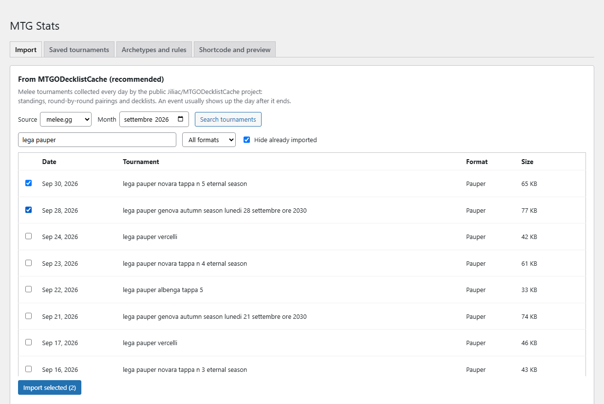
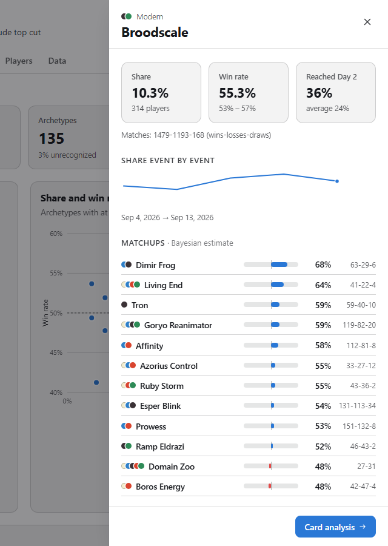
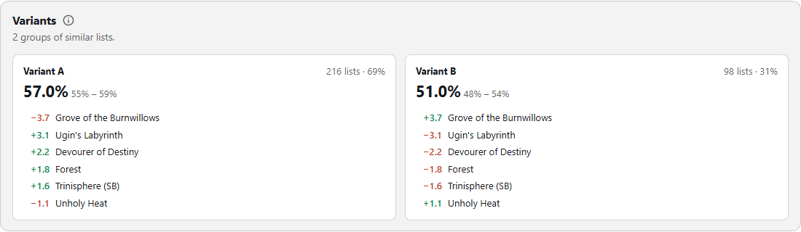

# User guide

This guide covers day-to-day use of the plugin: importing tournaments, checking archetypes and publishing the
dashboard.

The interface is in English or Italian, following the language of the WordPress site; on an Italian site, every
label in this guide appears in Italian. Labels are quoted here in English.

- [Two sides of the plugin](#two-sides-of-the-plugin)
- [Installing](#installing)
- [Importing tournaments](#importing-tournaments)
- [Reviewing archetypes](#reviewing-archetypes)
- [Aliases and custom rules](#aliases-and-custom-rules)
- [Managing saved tournaments](#managing-saved-tournaments)
- [Publishing the dashboard](#publishing-the-dashboard)
- [Reading the dashboard](#reading-the-dashboard)
- [Exporting data](#exporting-data)
- [Troubleshooting](#troubleshooting)

## Two sides of the plugin

| | Who uses it | Where | Purpose |
|---|---|---|---|
| **Admin panel** | site administrators | WordPress admin → **MTG Stats** | choose which events to import, check archetypes |
| **Dashboard** | site visitors | any page containing `[mtgstats]` | charts and statistics |

Importing runs in the administrator's browser. Keep the admin page open until the log shows **saved ✓** for every
event.

## Installing

1. Go to **Plugins → Add New → Upload Plugin**, select `mtgstats-1.0.0.zip`, then click **Install Now** and **Activate**.
2. A new **MTG Stats** entry appears in the admin menu.
3. Tournament data is stored in `wp-content/uploads/mtgstats/`, so uninstalling the plugin does not delete it.

To upgrade, upload the new zip the same way and confirm that you want to replace the installed version. Imported
tournaments stay compatible.

## Importing tournaments

Open **MTG Stats → Import**.



### From the cache (recommended)

The **From MTGODecklistCache** panel lists events collected every day by the public
[MTGODecklistCache](https://github.com/Jiliac/MTGODecklistCache) project. Each event comes with standings,
pairings for every round and all decklists. New events usually appear the day after they end.

1. Choose the **Source** (usually `melee.gg`) and the **Month**.
2. Click **Search tournaments**.
3. Narrow the list with the text filter, the format menu and **Hide already imported**.
4. Tick the events you want and click **Import selected**.

For each event, the log shows the player count, the detected format and how the archetypes were assigned. The first
import of a format also downloads its archetype rules, which takes a few seconds. The rules are then cached on the
server for 7 days.

### Directly from Melee

Use the **Directly from Melee** panel for events that are not in the cache yet.

1. Paste the tournament URL, for example `https://melee.gg/Tournament/View/123456`, or just its ID.
2. Keep **Also download decklists** ticked to get archetype detection and card statistics. Without decklists,
   archetypes come from the deck names declared by the players.
3. Click **Import from Melee**.

Requests go through your WordPress server, because melee.gg does not allow cross-origin browser requests. With
decklists, a large event (about 1,000 players) takes a few minutes. Rounds played in a format other than the main
one, such as Pro Tour draft rounds, are flagged and excluded from all statistics.

## Reviewing archetypes

After an import, the **Imported** panel shows how many decks were not recognized. Click **Review** on a tournament.
The review page can also be reached later from **Saved tournaments**.

On the review page you can:
- **edit the event details**: name, date, format;
- **include or exclude rounds** from the statistics, for example draft or invalid rounds;
- **rename an archetype for the whole event**: select it, type the new name and click **Rename**;
- **fix individual players.** The list shows **To check** by default: unrecognized decks, conflicts, and decks
  matched only by similarity. Click **List** to see the decklist, then type the correct archetype. Existing names
  are suggested as you type.

Click **Save changes** when done. Manual fixes are marked as *manual* and re-classification never overwrites them.

The **Method** column shows how each deck was classified:

| Badge | Meaning |
|---|---|
| rule | matched a community rule |
| variant | matched a rule and one of its variants |
| similarity | no rule matched; closest generic archetype ("fallback"), e.g. *Dimir Midrange* |
| conflict | several rules matched; the simplest was chosen (configurable) |
| unrecognized | nothing matched |
| no list | no decklist available; the declared deck name is used if present |
| declared | the format has no community rules; the declared deck name is used |
| manual | set by hand |

## Aliases and custom rules

**Archetypes and rules** holds fixes that apply to every event.

**Aliases**, one per line, as `Detected name => Displayed name`:

```
Simic Birthing Ritual => Simic Ritual
Neobrand => Simic Neoform
```

**Custom rules** use the same JSON schema as
[MTGOFormatData](https://github.com/Badaro/MTGOFormatData#archetypes) and take precedence over the community rules.
The optional `Format` field limits a rule to one format. **Insert example** fills in a starting point:

```json
[
  {
    "Name": "DevotedDruidCombo",
    "Format": "Modern",
    "IncludeColorInName": false,
    "Conditions": [
      { "Type": "InMainboard", "Cards": ["Devoted Druid"] },
      { "Type": "OneOrMoreInMainboard", "Cards": ["Vizier of Remedies", "Luxior, Giada's Gift"] }
    ]
  }
]
```

`Name` is written in PascalCase and split into words for display: `DevotedDruidCombo` becomes *Devoted Druid
Combo*. With `IncludeColorInName: true`, the guild or shard name goes in front, so `Midrange` becomes
*Dimir Midrange*. The condition types are listed in the [methodology](methodology.md#rules).

**Options**
- **Conflict handling**: pick the simplest matching rule (default), or label the deck `Conflict(A,B)`.
- **Bayesian win-rate prior**: the strength of the Beta(prior, prior) prior used for win-rate smoothing. The default
  is 10; 1 means almost no smoothing.
- **Custom accent color**: the color of bars, lines and active controls. When it is off, the dashboard uses the
  WordPress theme's primary color, if the theme declares one, or a neutral blue.
- **Reload community rules on the next import**: forces a fresh download of the rules.

After changing aliases or rules, go to **Saved tournaments** and click **Reclassify all**.

## Managing saved tournaments

**Saved tournaments** lists every stored event with its number of unrecognized decks. For each event:
- **Review**: opens the review page.
- **Reclassify**: runs detection again with the current rules and aliases, keeping manual fixes.
- **Delete**: removes the event file from the site. This cannot be undone.

## Publishing the dashboard

Add a **Shortcode** block containing `[mtgstats]` to any page or post. Available attributes:

| Attribute | Example | Effect |
|---|---|---|
| `format` | `format="Pauper"` | initial format |
| `days` | `days="60"` | initial period (`7`, `30`, `90`, any number of days, `all`) |
| `tournaments` | `tournaments="melee-gg-405590-2026-09-05"` | fixed selection; hides the format, period and event pickers |
| `tabs` | `tabs="meta,mu,pos"` | show only some tabs: `meta, mu, pos, trend, conv, cards, players, data` |
| `theme` | `theme="dark"` | `auto` (default) follows the page background; `light` and `dark` force a theme |
| `accent` | `accent="#c2412d"` | accent color for this page; overrides the setting and the theme color |
| `prior` | `prior="5"` | smoothing prior for this page |
| `lang` | `lang="en"` | `en` or `it`; by default, the site language |

Tournament IDs appear in the file names under `uploads/mtgstats/t/`. They look like `<source>-<event id>-<date>`.

To write an article about a single event, use the `tournaments` attribute; visitors then cannot change the
selection.

The dashboard adapts to the page it lives on:
- it uses the theme's font and text color;
- it detects whether the page background is light or dark;
- its accent color comes from the `accent` attribute, then the plugin setting, then the theme's primary color
  (block themes expose it as `--wp--preset--color--primary`);
- the filter bar stays visible while scrolling, below the WordPress admin bar when you are logged in.

**Shortcode and preview** in the admin panel shows a live preview of the dashboard.

## Reading the dashboard

**Filters.** The bar at the top stays visible while scrolling. It holds:
- the format;
- the period: 7 days, 30 days, 90 days or everything, counted back from the most recent event;
- the event picker, with search;
- the **Exclude top cut** switch, which drops playoff rounds.

Active filters show up as chips under the bar; click a chip to remove its filter.

**Sharing.** The current view is kept in the page address: tab, format, period, events, top-cut switch and open
archetype. **Copy link** copies it, and whoever opens the link sees the same view.

**Archetype profile.** Click an archetype anywhere to open its profile in a side panel (a bottom sheet on phones):
a bar, a dot, a table row, a matrix header or a panel title in Trends. The profile shows:
- share, smoothed win rate and conversion;
- share event by event;
- every matchup, with Bayesian estimate and record;
- variants and the average list;
- the best results.

**Card analysis** opens the full Cards tab. Press Esc or click outside the panel to close it.



**Shared conventions**
- **Smoothed win rate.** Matches are shrunk toward 50% with a Beta prior, so archetypes with few matches do not top
  the rankings. The raw win rate is always shown next to it.
- **Intervals.** The dot is the estimate and the line the uncertainty: 95% for win rates, 90% for matchups and
  expected win rates.
- **Explanations.** Each section has a one-line description. The ⓘ button next to the title opens the full
  explanation of how to read it.
- **Tooltips.** Hover, tap or focus any bar, dot or cell to see the raw counts.
- **Keyboard.** Arrow keys move between tabs, Tab moves through chart rows, Enter opens the profile.

**Tab by tab**
- **Matchups.** Switch between *Observed* and *Estimated*. A small dot in a cell marks a clear-cut matchup, where the
  favorite is favored with at least 95% probability.
- **Positioning.**
  - *Expected win rate*: the win rate to expect when bringing each deck against the chosen field. The tick shows
    the win rate observed so far.
  - *Equilibrium metagame*: the deck mix that the matchup matrix rewards. Read it as a theoretical indicator, not a
    forecast.
- **Trends.** The small charts share one vertical scale, so panels can be compared directly. The change shown is
  the last period minus the first.
- **Cards.**
  - *Average list*: can be copied into MTGO or Arena.
  - *Variants*: groups of similar lists, each with its own win rate.
  - *Card impact*: a correlation, not a causal effect. A card often just marks a variant.

  
- **Players.**
  - *Estimated strength*: the probability of beating an average player with the same deck.
  - *Deck or pilot?*: each archetype's win rate with pilot skill factored out.

The [methodology](methodology.md) explains every number in detail.

## Exporting data

The **Data** tab offers three CSV files per event:

| File | Columns |
|---|---|
| Standings | `Rank, Player, Deck, W, L, D, Winrate, Points` |
| Matches | `Round, Table, Player1, Player2, Deck1, Deck2, Games1, Games2, GameDraws` |
| Decklists | `Player, Deck, Section, Card, Qty` |

The **Metagame** tab also exports the full archetype table. Files are UTF-8 with a BOM, so Excel opens them correctly.

## Troubleshooting

| Symptom | Cause / fix |
|---|---|
| "GitHub request limit reached" | GitHub allows 60 anonymous API calls per hour per IP. A month search uses 2 and each new format 1. Wait, then try again. |
| Many *unrecognized* decks in a fresh format | A new set introduced archetypes that the community rules do not cover yet. Add a custom rule or fix the decks by hand. |
| Odd color names such as *WBRG Ponza* | Colors count both lands and spells, sideboard included, as in the original parser. Use an alias. |
| Wrong rules for an old Standard event | Rules are cached per format. Use *Reload community rules on the next import*, then reclassify. |
| The dashboard still looks like an older version after an update | Asset URLs change on every update, so this usually means a page cache. Clear your caching plugin or CDN cache once, then reload with Ctrl+F5. |
| The dashboard is dark on a light site | Your theme probably paints its background on an element that does not contain the shortcode. Add `theme="light"` to the shortcode. |
| Dashboard colors clash with the site | Set *Custom accent color* in the options, or `accent="#…"` in the shortcode. If the page background is an image or a gradient, set `theme="light"` or `theme="dark"`. |
| Wrong interface language | The language follows the WordPress site language. Force it with `lang="en"` or `lang="it"`. |
| Direct Melee import fails | Check that the event is public and that your server can reach `melee.gg`. If Melee changed its site, the importer needs updating; please open an issue. |
| Dashboard shows "Data unavailable" | `wp-content/uploads/mtgstats/index.json` is missing or blocked. Open **MTG Stats** in the admin once to recreate the folder. |
